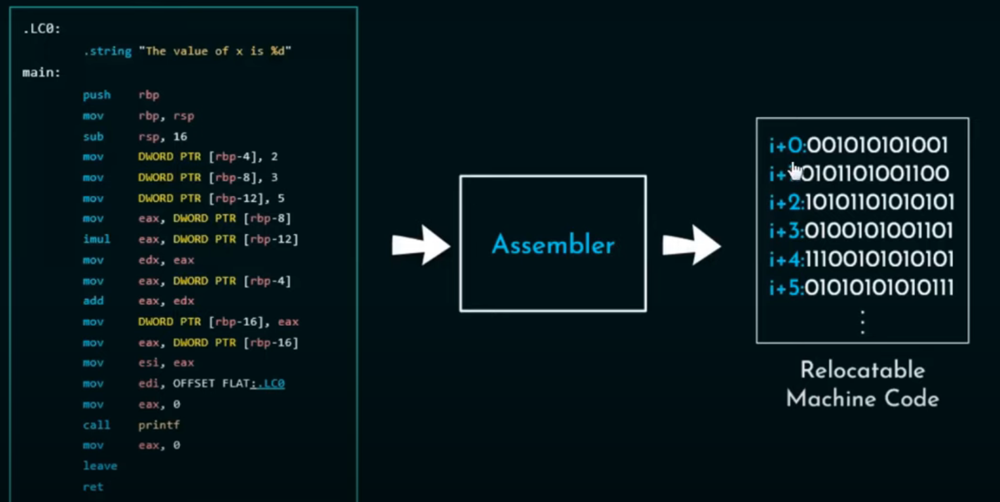

* University course (Systems Programming in C, 2020)
* 

# Assembler with Two Passes
This is a simple assembler with two passes. It processes input assembly code files, performs two passes, and generates executable files. The assembler uses linked lists for symbol table and memory image data structures. It is designed to handle errors and provide meaningful error messages.

## Functionality
The assembler performs the following tasks in each pass:

### First Pass
In the first pass, the assembler does the following for each line of code:

Parses the line to identify labels, commands, and operands.
Adds the command and labels to the symbol table (a linked list) if necessary.
Adds the command to the memory image (another linked list).
Checks for errors in the line and continues searching for more errors before proceeding to the second pass.
### Second Pass
In the second pass, the assembler performs the following tasks:

Parses each line again.
Updates the memory image with actual memory addresses for labels and operands.
Generates executable files for each assembly file.

### Error Handling
The assembler is designed to handle errors. If any error is found in the assembly code during the first pass, the assembler will stop processing and display an error message with the line number. The second pass will be skipped, and no executable files will be generated.

- 	To open 'assembler', open the terminal in the 'Maman14' folder and run the following:
- 	The files '.ob', '.ext', and '.ent' are created inside the folder 'tests'. If you want to change the output folder, modify the global
	variable 'dir' in 'files.c' to the desired location. 
	IMPORTANT: Create the folder first, then create the '.as' files, and finally, run the 'make' command followed by 'assembler'.

- 	Debug:
  	Details on each line: Uncomment the 'P_All' macro in 'main.c' -> 'first_pass()'. For example:
	cmp K #-6
	op_array[0]: K op_array[1]: -6 
	symbol: command:cmp i_command: 1 i_data: 0 src_rst: dst_rst: label:K opnum1:-999 opnum2:-6src_method:1 dst_method:0

- Details on symbol-table and memory-image: uncomment these functions in 'main.c'->'second_pass()'	printSymbolTable(symbolTable_head);
																												printDataImg(code_head);

Idan Kogan

