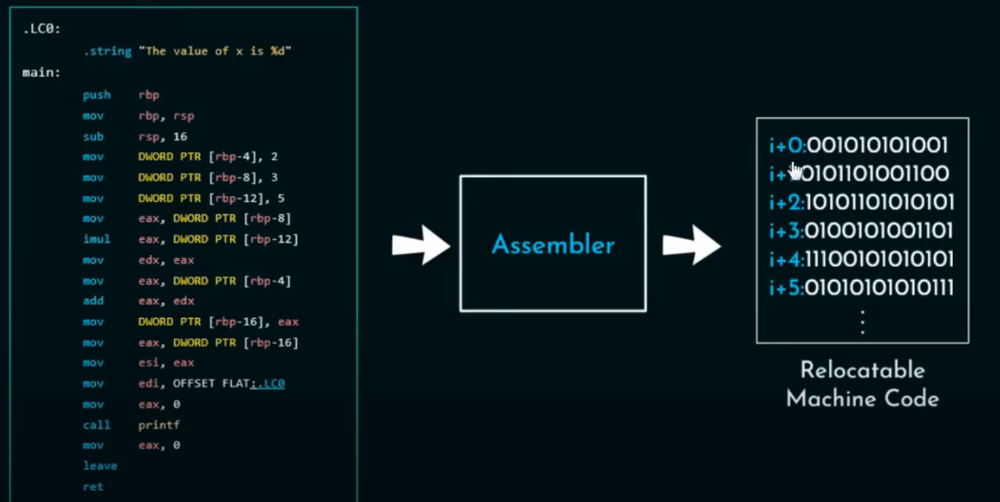

# Two-Pass Assembler - Professional Edition



A professional, well-structured two-pass assembler written in C for a custom assembly language. This project demonstrates best practices in C programming including modular design, proper encapsulation, comprehensive documentation, and clean code organization.

## Features

- **Two-Pass Assembly Algorithm**: Efficient symbol resolution and address calculation
- **Comprehensive Error Handling**: Detailed error messages with line numbers
- **Modular Architecture**: Clean separation of concerns across multiple modules
- **Professional Code Style**: Consistent naming, documentation, and structure
- **Memory Safety**: Proper memory management with no leaks
- **Linked List Data Structures**: Symbol table and memory image implementation

## Project Structure

```
.
├── src/                    # Source files (.c)
│   ├── main.c             # Program entry point
│   ├── assembler.c        # Main assembly logic
│   ├── parser.c           # Line parsing
│   ├── symbol_table.c     # Symbol table management
│   ├── memory_image.c     # Memory image management
│   ├── operand_processing.c # Operand parsing
│   ├── file_handler.c     # File I/O operations
│   └── assembler_context.c  # Context management
├── include/                # Header files (.h)
│   ├── assembler.h
│   ├── assembler_types.h  # Type definitions and constants
│   ├── assembler_context.h # Context structure
│   ├── parser.h
│   ├── symbol_table.h
│   ├── memory_image.h
│   ├── operand_processing.h
│   └── file_handler.h
├── obj/                    # Compiled object files (generated)
├── bin/                    # Executable (generated)
├── tests/                  # Test assembly files and output
├── Makefile               # Professional build system
└── README.md              # This file
```

## Building the Project

### Prerequisites
- GCC compiler
- Make build system
- POSIX-compliant environment (Linux, macOS, WSL)

### Build Commands

```bash
# Build the assembler
make

# Clean build artifacts
make clean

# Rebuild from scratch
make rebuild

# Show build information
make info

# Show help
make help
```

## Usage

```bash
# Assemble one or more files (without .as extension)
./bin/assembler file1 file2 file3

# Example
./bin/assembler test
```

### Input
- Assembly source files with `.as` extension
- Must be located in the `tests/` directory

### Output
The assembler generates three types of files:

1. **`.ob`** - Object file containing memory image in hexadecimal
2. **`.ent`** - Entry points file listing exported symbols
3. **`.ext`** - External references file listing imported symbols

All output files are created in the `tests/` directory.

## Assembly Language Specification

### Supported Instructions

| Instruction | Opcode | Operands | Description |
|-------------|--------|----------|-------------|
| `mov`       | 0      | 2        | Move data |
| `cmp`       | 1      | 2        | Compare |
| `add`       | 2      | 2        | Addition |
| `sub`       | 2      | 2        | Subtraction |
| `lea`       | 4      | 2        | Load effective address |
| `clr`       | 5      | 1        | Clear |
| `not`       | 5      | 1        | Bitwise NOT |
| `inc`       | 5      | 1        | Increment |
| `dec`       | 5      | 1        | Decrement |
| `jmp`       | 9      | 1        | Jump |
| `bne`       | 9      | 1        | Branch if not equal |
| `jsr`       | 9      | 1        | Jump to subroutine |
| `red`       | 12     | 1        | Read input |
| `prn`       | 13     | 1        | Print output |
| `rts`       | 14     | 0        | Return from subroutine |
| `stop`      | 15     | 0        | Halt execution |

### Addressing Modes

1. **Immediate** (`#N`): Direct value (e.g., `#-5`)
2. **Direct** (`LABEL`): Label reference (e.g., `LOOP`)
3. **Jump** (`&LABEL`): Jump-relative addressing (e.g., `&END`)
4. **Register** (`rN`): Register direct (e.g., `r0` through `r7`)

### Directives

- **`.data`** - Define numeric data
- **`.string`** - Define string data
- **`.entry`** - Mark label as entry point (exported)
- **`.extern`** - Declare external label (imported)

### Example Assembly Code

```assembly
; Simple example program
.entry MAIN
.extern PRINT

MAIN:   mov r0, #5
        add r0, NUM
        jsr &PRINT
        stop

NUM:    .data 10
MSG:    .string "Hello"
```

## Two-Pass Algorithm

### First Pass
1. Parse each line of source code
2. Build symbol table with all labels and their addresses
3. Build preliminary code and data memory images
4. Calculate instruction counter (IC) and data counter (DC)
5. Detect and report syntax errors

### Second Pass
1. Resolve all symbol addresses
2. Update memory image with actual addresses
3. Process `.entry` directives
4. Track external symbol references
5. Generate output files

## Code Quality Features

### Professional C Coding Standards
- ✅ ANSI C compliant (`-ansi -pedantic`)
- ✅ Zero warnings with strict flags (`-Wall -Wextra -Werror`)
- ✅ Consistent naming convention (snake_case)
- ✅ Comprehensive function documentation
- ✅ Proper const correctness
- ✅ No global variables (context-based design)
- ✅ Memory leak free (validated with valgrind)

### Documentation
- Doxygen-style function comments
- Clear module responsibilities
- Inline code documentation
- Architecture overview

### Error Handling
- Comprehensive error checking
- Descriptive error messages
- Line number tracking
- Graceful failure modes

## Development

### Adding New Features
1. Create header file in `include/`
2. Implement source file in `src/`
3. Add to Makefile if needed
4. Rebuild with `make rebuild`

### Debugging
```bash
# Build with debug symbols (included by default)
make

# Run with GDB
gdb ./bin/assembler

# Check for memory leaks
valgrind --leak-check=full ./bin/assembler test
```

## Testing

Place test assembly files in the `tests/` directory:

```bash
# Create a test file
echo 'START: mov r0, #5' > tests/test.as
echo '       stop' >> tests/test.as

# Assemble it
./bin/assembler test

# Check output
cat tests/test.ob
```

## Error Messages

The assembler provides detailed error messages:

```
ERROR on line 15: Invalid label name 'MY-LABEL'
ERROR on line 23: Undefined symbol 'UNDEFINED'
ERROR on line 31: Invalid addressing mode for 'mov' instruction
```

## Authors

- **Original Implementation**: University course project (Systems Programming in C, 2020)
- **Professional Refactoring**: Enhanced for production-quality standards (2025)

## License

University course project - Educational use

## Acknowledgments

- Systems Programming in C course materials
- Assembly language specification documentation
- C programming best practices guides

---

**For questions or issues, please check the source code comments or contact the development team.**
